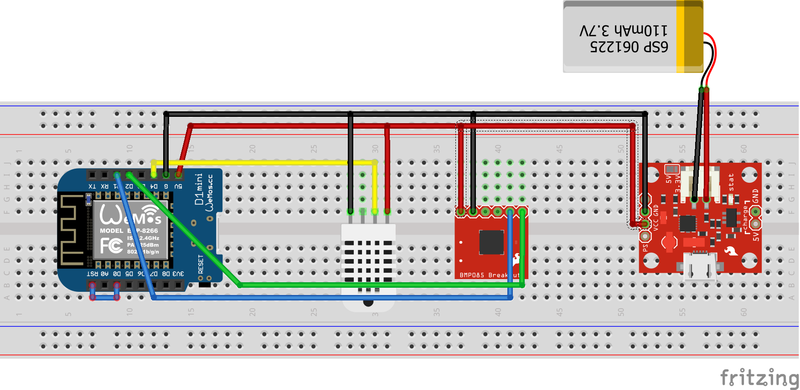

# Weather-Station-Project
[Work in Progress] A small weather station with MQTT DHT22 and BMP085

## Version 1.0

This is the basic ardiuino code for the weather station.

All the variables are clearly lableld for:
- Wifi config
- MQTT config
- Sensors pins config
- Delay config

In this code I use a **DHT22** Sensor for reading the Relative Humidity. The Temperature part is not used since the BMP085 does it better.
I also use a **BMP085** sensor for temperature & pressure sensing.

All the readings are sent to a **MQTT Broquer**. The default topic of the sensors are **sensor0/temp** for temperature, **sensor0/humi** for humidity and **sensor0/pres** for the pressure.

All the values are also sent in the serial monitor with a **default baud** rate of **9600**.

## Version 2.0

In this revision we concentrate on **reducing the battery** consumption of the chip by using **ESP.deepSleep();**.

In order to properely use this function I moved the code that was in the loop part to the void setup() part. I also changed the default delay to 60 seconds in order for the chip to sleep for roughly 85% of the time.

I also added a publish to a presence topic for detecting when something went wrong. The default topic is **sensor0/alive**.

**Important** You have to connect the **D0** pin to the **Reset** pin.

## Work in progress

- [x] Basic working code
- [x] Reconnection when disconnected
- [x] Battery Saving with DeepSleep
- [ ] Battery Monitoring
- [ ] Non Wifi wireless communication

## Schematics

